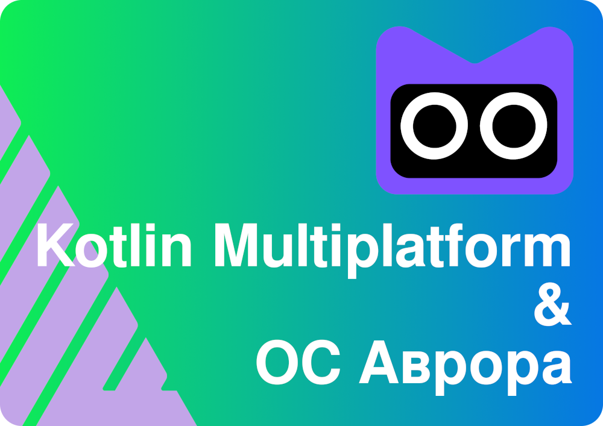

Demo KMP
===================



An application consisting of 4 separate projects: 3 applications and a module that unites them.

## Apps

* Module KMP
* Web app React + Electron
* Android + Compose
* Aurora OS

## Feature

Applications makes a request to the public REST API GitHub to obtain a list of repositories for three applications.

## License

```
Copyright 2024 Vitaliy Zarubin

Licensed under the Apache License, Version 2.0 (the "License");
you may not use this file except in compliance with the License.
You may obtain a copy of the License at

    http://www.apache.org/licenses/LICENSE-2.0

Unless required by applicable law or agreed to in writing, software
distributed under the License is distributed on an "AS IS" BASIS,
WITHOUT WARRANTIES OR CONDITIONS OF ANY KIND, either express or implied.
See the License for the specific language governing permissions and
limitations under the License.
```
